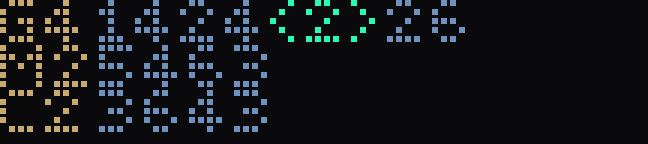
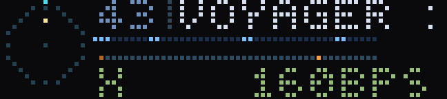
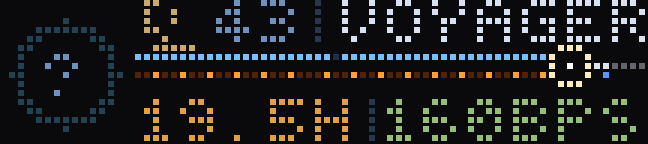
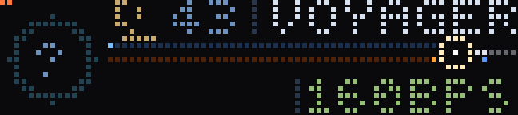
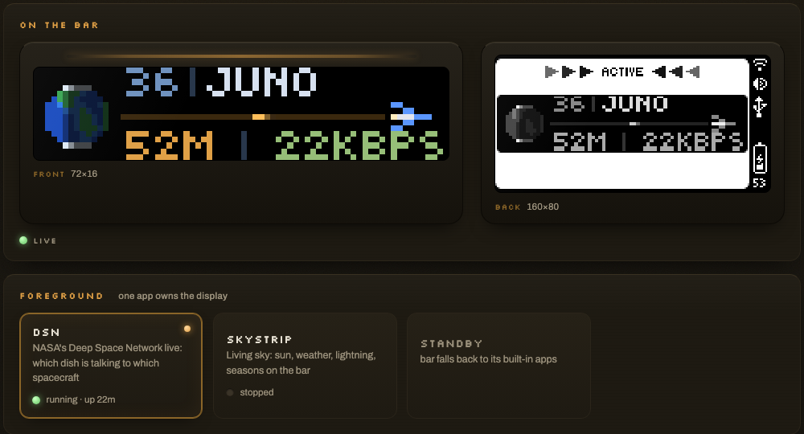

# BUSY Bar Lab

Live apps for the [BUSY Bar](https://busy.app) — a 72×16 RGB LED strip on your
desk — plus a control plane to run them on an always-on host.

This is an independent community project, not an official Flipper FZCO/BUSY
product and not endorsed by the device vendor.

The two primary apps are **DSN**, which displays current NASA Deep Space
Network activity, and **Skystrip**, which renders sky and weather conditions
for a configured location.

| | |
|---|---|
|  | **dsn, Network view** — the default, and the only one that shows the whole network at once: every site, its physical dishes, and how many live links each is carrying. `G3` means three live dish-to-spacecraft links at Goldstone; `34(2)` means DSS-34 carries two of them. Turn the wheel and it opens the selected dish's aim and co-dish links |
|  | **dsn, Instrument view** — one antenna and one contact, in detail. The RF lanes move because the numbers behind them do: received power, band, rate, and what Earth is transmitting back |
|  | **dsn, Distance view** — one of three live scales. Network defaults to an explicit three-site dish/link roster; wheel rest opens the selected physical dish's aim and co-dish links. Instrument shows one real antenna/contact; Distance preserves the Earth-to-spacecraft light-time journey shown here |
|  | **dsn**, locked to real time — one represented carrier slice, creeping. Frames are 27 minutes apart, because that is what one pixel of travel costs at Voyager's distance |
|  | **skystrip** — a whole day at the solstice at the public Greenwich demo fixture, half an hour a frame. Real solar elevation drives the light; the icon's horizontal placement is an artistic composition |
|  | **skystrip** through the year — same hour, same weather, only the date moves |
|  | **skystrip** weather — clear, overcast, drizzle, downpour, storm, severe, snow |
|  | **skystrip** at Christmas — the house roofline and the skyline windows, decorations off then on |

## Quickstart

Run the apps from a source checkout. You need **Git** and
[`uv`](https://docs.astral.sh/uv/getting-started/installation/); `uv` selects or
downloads a compatible Python 3.11–3.13 interpreter. The initial sync, dry run,
preview, and test suite do not need a BUSY Bar.

```bash
git clone https://github.com/subjektz3ro/busybar-lab.git
cd busybar-lab
uv sync --locked
uv run apps/hello.py --dry-run # validate the stack offline, no bar needed
uv run apps/hello.py           # with a bar: draw HELLO, save screenshots
uv run apps/hello.py --clear   # take it back down
```

The built Python wheel contains the reusable Python packages, Barkeep, and the
`busybar-viz` CLI. It is not a standalone bundle of the apps, their assets,
`apps.toml`, or the deployment scripts; use the source checkout to run or
develop this project.

### Platform support

| Platform | Support level |
|---|---|
| **Linux** | The supported service target is 64-bit glibc 2.28+ Linux on `x86_64` or `aarch64`, with Python 3.11–3.13. CI gates Ubuntu 24.04 x86_64 on Python 3.11 and 3.13; the systemd deployment path supports both CPU families. Other Linux combinations are unsupported. |
| **macOS** | A source-development and direct-run path is provided, with `say` for speech. It is not CI-gated and has no systemd service installer. |
| **Windows** | Not currently supported or tested. The deployment tooling requires Bash and the service path requires systemd; use a Linux host (or an unverified WSL setup) instead. |

The supported stack uses CPython 3.11–3.13. On supported Linux service hosts,
Skystrip and DSN use Kokoro for speech. The installer verifies the package,
the SHA-256 hashes of the model and voice-bank files, and a short synthesis
before installing or starting Barkeep. At runtime, Linux selects `espeak-ng`
if Kokoro cannot be imported or its model bank is unavailable. Direct macOS
development uses `say`.

For a Linux service installation, clone the repository on the host and run
[`./deploy/install.sh`](deploy/README.md). It syncs the locked environment,
creates or preserves `.env`, downloads and verifies the Kokoro files, runs the
synthesis check, and can install Barkeep as a systemd service.

```bash
git clone https://github.com/subjektz3ro/busybar-lab.git
cd busybar-lab
./deploy/install.sh
```

Plugged in over USB the bar answers at `10.0.4.20` with no authentication. For
local Wi-Fi/LAN access set `BUSYBAR_HOST` and `BUSYBAR_TOKEN`; this repository
does not route device traffic through the vendor cloud.

Most development tasks do not require a bar. Offline checks vary by app because
native text draws and raster scenes use different rendering paths:

| Command | BUSY Bar | External network | What it checks |
|---|---:|---:|---|
| `uv run apps/hello.py --dry-run` | no | no | Builds the native draw request |
| `uv run apps/dsn.py --dry-run` | no | yes | Fetches and describes the live NASA feed |
| `uv run apps/skystrip.py --preview sky.png` | no | no | Renders one PNG without device I/O |
| `uv run pytest -q` | no | no | Runs the hardware-free test suite |

```bash
uv run apps/skystrip.py --preview sky.png --at 03:30 --storm
uv run pytest -q
```

### Visual validation with busybar-viz

`busybar-viz` renders and audits front and back display output without a
physical panel. It records exact pixels, checks configured display constraints,
simulates LED spacing, replays timed button and wheel input, and produces
immutable artifacts for automated and human review.

```bash
uv run busybar-viz view scratch/candidate.png --json   # see any frames, zero setup
uv run busybar-viz run conformance/dual-display-input-replay --json
uv run busybar-viz compare BEFORE_SHA AFTER_SHA --json
uv run busybar-viz baseline check --json   # CI-enforced pixel regression gate
uv run busybar-viz serve       # optional human review UI at http://127.0.0.1:8765
```

Every registered scenario's accepted pixels are pinned in
[`viz-baselines.toml`](viz-baselines.toml): CI runs `doctor` for required
audits and `baseline check` for pixel drift. A pull request that deliberately
changes what the panel shows records that acceptance in the same diff;
unacknowledged drift fails.

`view` audits ad-hoc in-development frames — including an app's enlarged
`--preview` output — with no registration, and `--region`/`--ink` bring the
device-law legibility checks to them. Registered scenarios (`run`) add
declared source provenance; production-renderer scenarios record that app-owned
code produced the pixels. Renderer workers block ordinary network/device
access. Registration is one `[<app>.viz]` table in `apps.toml` (how
`dsn/default` is declared);
hand-written adapters cover Skystrip and an app-neutral conformance fixture.
Hello draws native firmware text, which the visualizer deliberately does not
emulate.

“Offline” describes rendering: it needs neither a bar nor external network
access. The optional `serve` command is a loopback HTTP development UI and
stores its append-only review journal in a local SQLite file. It is not part of
Barkeep. The CLI wheel is tested in isolation, but app adapters intentionally
load production source and assets from the active checkout, so run it from a
clone rather than treating the wheel as a standalone app bundle.

The CLI can render, audit, and compare output without a review session. For
collaborative review, the UI stores ordered feedback in an append-only session
journal. An agent can render a candidate, make its exact SHA current with
`uv run busybar-viz session present`, then wait for design feedback in the
same turn with `uv run busybar-viz session events SESSION_ID --after REVISION
--wait 55 --json`. See [the complete visualizer guide](docs/busybar-viz.md) for
app adapters, semantic inputs, artifacts, comparisons, and the evidence levels
that distinguish a renderer result from an actual panel observation.

## The apps

| App | What it is | |
|---|---|---|
| **dsn** | NASA's Deep Space Network, live — global Dish Roster, selected-dish Focus, selected-contact Instrument, and the original Distance/light-time journey | [docs](apps/dsn.md) |
| **skystrip** | An ambient sky outside — coordinate-based global model weather, NWS observations/alerts where its point API covers the location, and northern-temperate seasonal art | [support + docs](apps/skystrip.md#geographic-support) |
| **hello** | The smoke test: draw and screenshot, with optional speech | [docs](apps/hello.md) |

Each doc covers what the app shows, **what every button does**, its config keys
and where its data comes from. [`apps/README.md`](apps/README.md) has the
conventions they share.

DSN includes 24 mapped spacecraft portraits for 105 identifiers, plus a generic
fallback. Perseverance is rendered as a rover, and Juno's portrait uses a
moving specular highlight based on its 2 rpm spin. The globe terminator uses
the calculated subsolar point, and antenna tilt uses pass elevation.

## barkeep — the control plane



_Representative capture; it predates the provider-use line now shown below
the display previews._

An always-on daemon that supervises the apps and serves a web UI on `:8080`: a
live mirror of both displays, which app owns the bar, per-app logs, and a
config editor generated from each app's declared keys.

A fresh Barkeep starts in **STANDBY**. Before selecting Skystrip, Barkeep's
display-preview panel shows linked Open-Meteo/RainViewer credits and
public-service limits; selecting Skystrip is what starts those provider
requests. Previously saved foreground choices still restore on restart.

```bash
uv run -m barkeep      # development/manual launch; open http://localhost:8080
```

On a supported Linux service host, run `./deploy/install.sh` first so the
Kokoro package and model files have been verified.

One app owns the display at a time — [apps cannot
overlay](apps/README.md#why-apps-dont-overlay), which is a property of the
device, not a design choice.

**Barkeep supports loopback and LAN operation.** A fresh installation binds to
`127.0.0.1` for local use or access through an SSH tunnel. For direct LAN
access, set `BARKEEP_BIND` to a LAN address (or `0.0.0.0`), configure a strong
`BARKEEP_TOKEN`, and set `BARKEEP_TLS=1`. This enables HTTPS with a persistent
self-signed certificate, which can later be replaced through the UI. The token
lives only in the host's gitignored `.env`; the web UI asks for it once per
browser and keeps a cookie after that
([how to log in](deploy/README.md#logging-in-from-another-machine)). The
daemon warns when it is exposed without a token.
[`SECURITY.md`](SECURITY.md) is the full statement.

## Running it on a server

The supported service host is a 64-bit glibc 2.28+ Linux machine on `x86_64` or
`aarch64` that stays on and can reach the bar — for example, a Pi 4/5 with
64-bit Raspberry Pi OS and at least 2 GiB RAM, a NUC, a 64-bit laptop, or a VM.
The supported service deployment uses systemd. The host never needs to accept
connections from the internet.

What it needs before you start, none of which ships on a minimal image:

| | Why |
|---|---|
| **`uv`** | Creates the exact locked environment and supplies a compatible Python 3.11–3.13 interpreter when needed |
| **`git`** | Required for installation and updates because `ship.sh` fetches into the host checkout; `install.sh` exits if Git is unavailable |
| **`curl`** | Downloads the required, hash-pinned Kokoro model files on Linux |
| **`bash`** | `install.sh` and `ship.sh` are bash, not POSIX sh |
| **`openssl`** | Optional: generates the persistent self-signed certificate for `BARKEEP_TLS=1` |
| **`sudo`** | For installing the `espeak-ng` fallback, and for `systemctl` if you run it as a service |
| **systemd** | Only if you want it supervised across reboots |
| **an ssh server** | Only if you deploy with `ship.sh` rather than pulling by hand |

Install `uv` through a trusted package manager or its
[official instructions](https://docs.astral.sh/uv/getting-started/installation/),
then run `./deploy/install.sh` as the unprivileged account that will own the
checkout and run barkeep — never with `sudo`. The installer syncs the Python
packages and speech voice, and invokes `sudo` itself only for the optional
package-manager and systemd operations that require it. On a systemd host it
offers to install barkeep as the one service that supervises every app.

Have at least **1 GB of free disk** and **2 GiB of RAM**. A
clean installed checkout is about **600–650 MiB**, including the roughly 340
MiB model bank; the `uv` download cache can temporarily retain a few hundred
MiB more, and neural synthesis can approach 1 GiB of resident memory.
[`docs/dependencies.md`](docs/dependencies.md) has the full support and resource
matrix.

```bash
./deploy/install.sh                    # environment, required Kokoro, optional service
```

If you skip the service prompt, the manual commands remain in
[`deploy/README.md`](deploy/README.md).

On a remote server, reach the loopback-only control plane through SSH:

```bash
ssh -N -L 8080:127.0.0.1:8080 your-user@server.example
```

Then open `http://127.0.0.1:8080` on your own computer and select **Skystrip**
or **DSN**.

To update an ordinary install from this public repository, run this in the
server checkout:

```bash
sudo systemctl stop "barkeep@$USER"
git pull --ff-only
./deploy/install.sh
```

Stopping first prevents the running daemon from loading a mixture of old and
new files during the update. The installer keeps `.env`, resyncs the lockfile,
rechecks the Kokoro models and real synthesis, refreshes the service unit when
needed, and starts the enabled service only after those checks pass. If you
run Barkeep manually instead, stop that process before pulling and start it
again after the installer succeeds. If you develop your own changes, use the
separate maintainer deploy flow after pushing them to a remote you control:

```bash
git push origin main
./deploy/ship.sh myhost
```

`ship.sh` refuses to deploy a commit that isn't on origin, because the host
couldn't fetch it. Full detail, including the read-only deploy key a
private-repo host should use, is in [`deploy/README.md`](deploy/README.md).

## Building an app

```bash
uv run scripts/new_app.py yourapp     # template + apps.toml entry in one step
uv run apps/yourapp.py --dry-run      # also law-checks the payload offline
```

[`docs/agent-cookbook.md`](docs/agent-cookbook.md) lists the app workflow:
create, render, iterate, register, pin, and capture.

Before changing display output, read
[**`.claude/skills/busybar-app/SKILL.md`**](.claude/skills/busybar-app/SKILL.md).
It documents device behavior and known failure modes.

While a visual is moving, audit each iteration with `uv run busybar-viz view`
— any PNG frames, zero setup, with the device-law legibility checks on the
regions you declare. When it stabilizes, register its default scenario as
data: a `[<app>.viz]` table in `apps.toml` naming one pure production
renderer seam (see the header comment there). Hand-written adapters, planned
with `uv run busybar-viz scaffold`, are only for apps that need typed
controls, input replay, or fault injection. The
[`busybar-viz` skill](.claude/skills/busybar-viz/SKILL.md) gives agents the
working loop; [`docs/busybar-viz.md`](docs/busybar-viz.md) is the exact
CLI and evidence contract. Production apps never import the visualizer, and a
generated LED-gap preview is not evidence that anyone inspected it.

Priority is not z-order. Most element fields are immutable after the first
draw. Assets are cached by path forever. `timeout` is whole seconds. Text is
printable ASCII only. One felt click of the wheel is one encoder count. And the
LEDs are spaced nearly their own width apart — 1.23 mm lit on a 2.2 mm pitch —
so a filled shape reads as a haze, brightness reads as *size*, and anything
under about 30% contrast is invisible on the panel however good it looks in a
preview.

`new_app.py` has already added the [`apps.toml`](apps.toml) entry that makes the
app appear in Barkeep with a generated config editor. If Barkeep is already
running, restart the Barkeep daemon to reload the registry; restarting only a
child app does not reload `apps.toml`. See
[`CONTRIBUTING.md`](CONTRIBUTING.md).

## Documentation and agent guidance

| | |
|---|---|
| [`AGENTS.md`](AGENTS.md) | Contributor requirements, device behavior, and architecture |
| [`docs/README.md`](docs/README.md) | Index of first-party guides, app docs, external references, and historical design records |
| [`docs/dependencies.md`](docs/dependencies.md) | Host packages, model files, resource budgets, and TTS selection |
| [Official BUSY developer docs](https://docs.busy.app/bar/dev) | Current device setup, API access, and HTTP API guidance from the vendor |
| `docs/api/openapi.yaml` | Optional, gitignored OpenAPI snapshot fetched from a connected device for local inspection |
| `docs/busylib/` | Redistributable official Python client docs, examples, licence, and its own `AGENTS.md` |
| `.claude/skills/busybar-app/` | Device drawing and interaction constraints |
| `.claude/skills/busybar-viz/` | Visual rendering, audit, comparison, and evidence guidance |

With a bar reachable, `uv run scripts/refresh_docs.py` can refresh the ignored
local device specification. The public repository does not redistribute a
scraped copy of the vendor documentation.

Release notes are in [`CHANGELOG.md`](CHANGELOG.md).
Source on `main` may include the changelog's **Unreleased** section;
`pyproject.toml` keeps the most recently released version until the next tag is
cut. Use a release tag when you need a fixed public version.

## Architecture

The same app code runs during USB development and on a service host. Apps
receive device connection settings through configuration instead of hardcoded
addresses. Diagrams and the directory map are in
[`docs/architecture.md`](docs/architecture.md).

## Licence

**GPL-2.0-or-later.** The copyleft requirement comes from
`busybar_dev/anim.py`, a port of upstream GPL-2.0-or-later firmware tooling.
The or-later grant also permits use under GPLv3 alongside the Apache-2.0 Astral
dependency. Third-party material, data-source terms, licence details, and
attribution are in
[`NOTICE.md`](NOTICE.md).
