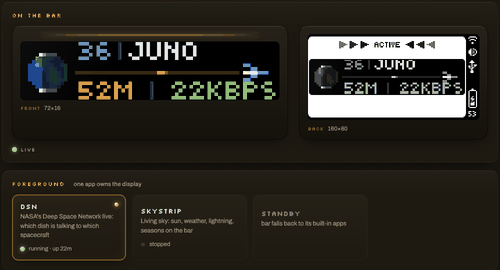

# The apps



_Representative capture; it predates the Skystrip provider-use line now shown
below the display previews._

Each app owns the BUSY Bar's 72×16 front strip and draws something live to it.
One app is on screen at a time — see [Why apps don't overlay](#why-apps-dont-overlay).

| App | What it is | Docs |
|---|---|---|
| **dsn** | NASA's Deep Space Network, live: which antenna is talking to which spacecraft, and how long that conversation takes at the speed of light | [dsn.md](dsn.md) |
| **skystrip** | The sky outside, live: real sun position, cloud cover, moon phase, rain and snow, plus opt-in lightning from an authorized feed | [skystrip.md](skystrip.md) |
| **hello** | The smoke test. Draws text, optionally speaks, screenshots both displays | [hello.md](hello.md) |
| **_template.py** | Source template used by `scripts/new_app.py` | — |

## Running one

Any app runs standalone from the repo root:

```bash
uv run apps/dsn.py --dry-run     # validate the data path without a device
uv run apps/dsn.py --once        # push a single frame and exit
uv run apps/dsn.py               # run continuously; Ctrl+C clears the bar
```

In production they run under [barkeep](../barkeep/), the host's control plane,
which starts and stops them and serves a web UI on port 8080. Barkeep owns
which app is in the foreground; don't run a second copy by hand while it's
running, or the two will fight over the display.

Skystrip's standalone watcher and live report require the explicit
`--enable-network-providers` guard after you review its
[provider terms and credits](skystrip.md#provider-terms-and-commercial-use);
its offline preview and device-only `--once` path do not.

## Code map

The entry-point modules keep rendering, device ownership, and interaction
sequencing together, because those paths share generation counters and scene
state. Pure boundaries live beside them:

| Module | Owns |
|---|---|
| `dsn_config.py` | Immutable runtime configuration and managed cache paths |
| `dsn_source.py` | Bounded NASA XML ingestion and the remote-source domain models |
| `skystrip_config.py` | Immutable runtime configuration, paths, and endpoint validation |
| `skystrip_lightning.py` | Bounded decoding of the optional lightning wire format |

The entry points re-export these modules' established names, so existing app,
test, and visualizer imports continue to work while a reader can start at the
boundary relevant to the change.

## The controls

The bar has two inputs: a scroll wheel that also clicks, and the START button.
Control bindings differ between Skystrip and DSN:

| | **skystrip** | **dsn** |
|---|---|---|
| **Wheel turn** | Scrub the forecast in half-hour steps | Move through the live signals |
| **Wheel click** | Back to now | Lock onto this signal, and switch it to real time |
| **START** | Next scene (double-press speaks the report) | Narrate this signal aloud |

Wheel click returns Skystrip to the current time. In DSN, it locks the selected
signal and enters real-time mode.

Both apps use a **reveal-on-stop** pattern: turning the wheel puts an immediate
read-out on the panel, and the full redraw occurs after the wheel rests. Do not
re-render a scene per detent; an `.anim` upload is about 80 kB and takes about
one second.

Both inputs arrive on the device's status websocket. If an app seems
unresponsive, that stream is the first thing to check. One felt click is
**one** encoder count — don't invent a divisor.

## Configuration

No app hardcodes anything personal. Values come from the environment:

- **Shared**: `.env` at the repo root (gitignored; `.env.example` documents
  every key). `BUSYBAR_HOST` and `BUSYBAR_TOKEN` live here.
- **Per app**: `config/<app>.env`, layered on top of the shared `.env`.
- **Declared**: [`apps.toml`](../apps.toml) lists each app's keys with a type,
  which is what draws the config editor in barkeep's web UI. Adding a key
  there is what makes it editable without a redeploy.

## Why apps don't overlay

Two apps drawing at once do **not** composite. Per the
[device HTTP API documentation](https://docs.busy.app/bar/dev/http-api), a
draw is accepted when its priority is greater than *or equal to* the running
app's — so an equal-priority draw from a different `application_name` simply
takes the display, and the loser gets it back on its next redraw. Priority is
not z-order.

The practical consequences:

- An app that wants to interrupt must **own the strip for a bounded window and
  then hand it back**, never draw "on top".
- Layering exists only *within* one app, where elements merge by `id`.
- An active BUSY or CUSTOM focus session refuses outside draws entirely with
  HTTP 409, at any priority. That 409 means "yield and retry", never "failed".

## Building a new one

`uv run scripts/new_app.py yourapp` copies the template and registers the new
app in `apps.toml` without overwriting an existing file. Then read
[`.claude/skills/busybar-app/SKILL.md`](../.claude/skills/busybar-app/SKILL.md).
It documents draw priority, mutable element fields, asset-path caching, LED
spacing, and other known failure modes.

Before touching a bar, run the generated app's offline contract:

```bash
uv run apps/yourapp.py --dry-run
```

If Barkeep is already running, restart the Barkeep daemon after scaffolding so
it reloads `apps.toml`. An app-only restart cannot discover a registry entry
that the parent daemon has not loaded yet.
