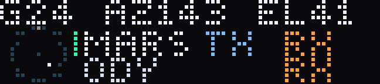
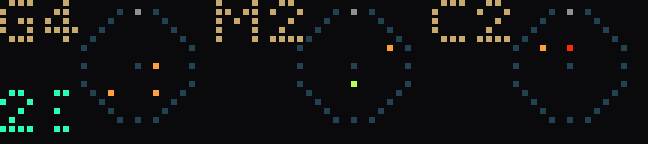

# dsn — the Deep Space Network, live

`dsn` displays active dish-to-target associations reported by NASA DSN Now at
three scales. **Network** summarizes activity at Goldstone, Madrid, and
Canberra. **Instrument** shows one selected antenna and contact. **Distance**
shows the represented Earth-to-spacecraft journey and its light-time watch.

## Dish Roster — the default live network


*`G4` is Goldstone carrying four associations; the numbers beside it are its
physical dishes. Ordinary rows are static on purpose — motion here would mean
something changed.*

Network defaults to three explicit site rows: Goldstone on top, Madrid in the
middle and Canberra on the bottom. Each row answers two separate questions:
how many displayable dish-to-tracked-target associations this site has, and which
physical dishes own them.

```text
G3  26  27(2) …                                                freshness
M0  NO LINKS                                                   freshness
C5  34(2) 35 36 43 …                                          freshness
```

The site letter and exact association total stay fixed at the left. The dish
roster to their right uses each DSS suffix once (`34` means DSS-34). A mint
`(n)` immediately after a suffix says that one physical dish currently carries
`n` accepted tracked-target associations. The selected physical dish is white;
the rest use the site's colour. If the complete roster is wider than its lane,
it moves as a bounded marquee so no suffix or multiplicity is amputated. That
text movement is pagination, not live RF activity.

`C5 34(2) 35 36 43`, for example, means five displayable associations spread
across four physical Canberra dishes. It does not mean five dishes, five
unique targets, five streams or five packets. Totals are exact—including
10 and above—and are not capped to one digit. A dish's `(n)` counts accepted
dish-to-tracked-target associations, not that contact's up/down signal records.

Most targets are spacecraft. A few source identities are tracked flight
hardware such as an Artemis upper stage; they count because they are real
dish-to-target associations, even though narration correctly says they are not
spacecraft. Known calibration, test, radio-astronomy and non-flight identities
are filtered and do not count.

The three sites are spaced around Earth so one complex can hand a visible
spacecraft to another as Earth turns. That supplies global *opportunity* for
continuous coverage; it does not mean every complex, dish or mission has an
active contact all the time. DSN antenna time is scheduled, missions have
different contact requirements, and maintenance, calibration, engineering,
tests, radio science and astronomy also use the hardware. DSN Now reports the
current source state, not the planned schedule.

`NO LINKS` has a deliberately narrow meaning: in the latest accepted snapshot,
the app found no displayable active tracked-target `upSignal` or `downSignal`
association for that complex after filtering known test, calibration,
radio-astronomy and other non-flight identities. It does **not** mean the site
is idle, powered down, out of view or
broken. Signal-less engineering activity is outside this link roster, and a
source or pipeline gap can look the same. If every complex lacks a displayable
association, the app uses the full-screen `NO LINK DATA` state instead of three
empty rows.

The far-right pixel is the source-freshness rail described below; x70 remains
an intentionally black gutter. Colours and motion in the roster never claim
rate, power, range or physical packet movement.

### Selected-dish Focus — only after you turn the wheel



*DSS24 at azimuth 143°, elevation 41°, carrying two spacecraft on the one
aperture. The roster counts that; only Focus can show it.*

One wheel detent immediately draws the native picker (`MMS2 1/5`) without
waiting for an animation upload. After the wheel rests, Network freezes that
accepted snapshot and opens Focus for the selected **physical dish**. Ambient
roster paging stops during this bounded inspection.

```text
C34 AZ048 EL22                                               freshness
  local aim scope  | MARS RECONNAISSANCE ORBITER  TX RX
                   | MAVEN                         RX
```

The full-width header names the dish and its source-published aim: azimuth is
zero-padded to three degrees clockwise from north and elevation to two degrees
above the horizon. If the dish has no usable, consistent aim it says the
complete `C34 NO AIM`; no marker or geometry is invented. A future header that
cannot fit becomes a complete marquee rather than a clipped label. Multiplicity
stays in the ambient roster's `34(n)`—Focus does not misleadingly repeat it in
the header.

The small scope is one local alt-az frame for that physical dish. North is at
the top, east at the right, the rim is the horizon and the centre is zenith.
Its single marker is the direction the antenna is pointing, **not** the
spacecraft's position in a global sky or an orbit plot. If co-dish records
publish inconsistent aims, Focus uses `NO AIM` rather than choosing a winner.

The exact wheel/START-selected spacecraft repeats on every Focus page and is
owned by a five-pixel mint bar at the left of its row. When the dish carries
more than one association, the second row walks one other co-dish link per
page; a one-link dish uses only the selected row. If the product of unusually
many contacts and unusually long names would exceed the bounded native-asset
budget, the last page says an exact `+N TARGETS` instead of allocating an
unbounded animation or silently dropping rows. NASA's friendly full name is
used when available, otherwise the complete live code. Long names marquee
inside their lane and unsupported custom-font characters become `?` instead
of disappearing. Complete blue `TX` and band-coloured `RX` labels report link
direction only; violet `RX` means mixed or unknown receive band. They are not
stream totals, power or bitrate.

Focus is not an ambient carousel. It is armed only by a rested wheel selection,
holds for one complete semantic/name cycle, then returns to the current Dish
Roster with the action target retained while that exact association remains
live. A refused draw does not consume the intent. Delayed/stale source state,
departure or handoff ends Focus rather than presenting old aim as current, and
Focus cannot be armed from an already delayed/stale snapshot. Instrument and
Distance remain the deeper views; START, hold and tap retain their established
meanings.

### Three Skies — pointing rollback style



*The same network as three local horizons, so elevation reads as height
rather than as a number.*

Set `DSN_NETWORK_STYLE=skies` to restore the earlier equal triptych and its
wheel-rest Focus Lens without reverting code. Goldstone, Madrid and Canberra
each get an independent local alt-az ring—not three pieces of a shared
spacecraft map. North is at the top, east at the right, the rim is the horizon
and the centre is zenith. A head is the published aim of a physical dish,
quantized to the 72×16 panel; there is no radar sweep, predicted orbit or
decorative interpolation.

`G#`, `M#` and `C#` retain the same association-total meaning as Dish Roster.
Red/orange/yellow-green/pale heads are received S/X/K/Ka carriers, violet is
mixed/unknown receive band and blue is uplink-only. The selected association
is white and keeps up to four earlier pixel-visible aim cells as a green
observed-history tail. Missing or inconsistent aim is counted explicitly as
`?N`; contacts sharing one quantized cell keep one displayed point and a
nonspatial bracket/count instead of being jittered apart. In this dense
rollback layout, ten or more site associations use an explicit overflow token
such as `G>`; missing/collision ledgers use `+` after nine. Neither silently
states that a larger count is exactly nine. Dish Roster remains the exact-count
view.

Its historical Focus Lens expands the selected site while keeping the other
two as context scopes, and its data-specific Handoff Echo can pulse the old and
new measured cells for an unambiguous handoff. Those are `skies`-only
behaviours; the default Dish Roster uses the selected-dish Focus above and the
generic/text transition grammar described later.

### Legacy contact rows — rollback style

Set `DSN_NETWORK_STYLE=rows` to restore the previous three-row board without
reverting code. Goldstone is the top row, Madrid the middle and Canberra the
bottom. Each row shows a DSS suffix, an available identity marquee (NASA's
friendly name when that craft has a config entry, otherwise the complete live
short code; unsupported custom-font characters appear as `?`), an
upper Earth-to-spacecraft rail, a lower spacecraft-to-Earth rail, up to three
moving records, a receive-record count at the right, compact mode marks and
the shared freshness rail.

Rows page through contacts. The busiest complex determines the page count; a
complex with fewer contacts repeats its shorter list while the other rows
advance. Each bounded page lasts at least one complete eight-second RF cycle,
extends by whole cycles for a long name and prewarms the following resident
asset. Its moving dots are symbolic direction/record/band marks—not packets,
rate, power, range or light time. Exact receive-record count, `0` for a valid
uplink-only contact and the S/X/K/Ka colour grammar remain documented by the
on-screen Instrument details and this fallback's tests. The one-glyph rollback
cell is exact through `9` and uses `+` for ten or more; Instrument carries the
full accepted count.

### Reading the freshness rail

| Rail | Meaning |
|---|---|
| Moving two-LED cyan dash | NASA's own source timestamp advanced. Its vertical position is only a heartbeat step; it has no physical meaning. Repeated HTTP success with the same timestamp does not move it. The baked fresh scene leaves x71 dark; a short native lease owns the cyan dash so it expires if the host dies. |
| Three amber dots, blinking one second on/one second off | `FEED DELAY`: no newer source timestamp for roughly 25 seconds at the default poll rate. Dish Roster holds its last accepted roster and retires an open selected-dish Focus; Three Skies holds its last heads/tail; `rows` and Instrument freeze RF motion. This can be the source, pipeline or polling path; it does not prove the real DSN link stopped. |
| Three steady red dots | `FEED STALE`/offline: no usable newer source version for roughly 50 seconds at defaults. The last accepted geometry stays frozen rather than making old data look current. |

Hold the wheel to move to Instrument, then Distance, then back to Network.

## The selected-link instrument


*One antenna, one contact. The RF lanes move because the numbers behind them
do — received power, band, rate, and what Earth is transmitting back.*

Instrument requires the live feed because it uses current dish pointing and
radio-link state. An offline spacecraft list does not provide those fields.

- **The 15×15 polar scope on the left is the antenna's real azimuth and
  elevation.** North is at the top, east is to the right, the horizon is the
  ring and zenith is the centre. The bright point is the latest accepted
  pointing sample from NASA. The short tail keeps up to seven pixel-visible samples including that
  latest point; it is sampled pointing history, not a predicted track or a
  spacecraft orbit.
- **The upper blue lane is the uplink.** It moves from the dish toward the
  spacecraft only when an active `upSignal` is present. If NASA publishes
  several active up-signal records, up to three occupy separate rows and the
  metric pages state the accepted record count (with a defensive `>99` token
  beyond the source budget). Their individual power
  flares use coarse buckets; power is never summed without a documented meaning.
- **Up to three lanes represent the published downlink records.** A positive
  published rate adds warm, band-coloured marks moving from the spacecraft
  toward the dish; S, X, K and Ka retain their own colours, and denser marks
  mean a higher rate bucket. A zero or unknown rate keeps the active slate
  tether and its published metric but adds no moving carrier mark. All marks
  move at one symbolic speed: this view is a radio activity instrument, not
  the light-time model. If more than three records are active, the first two
  remain literal and the third lane explicitly reports the overflow record
  count without inventing an aggregate rate or power.
- **The flare where a downlink meets the dish carries received power**, in
  coarse buckets suitable for the physical LEDs. The metric row pages through
  band and a rate only for a single receive record; a multi-record contact says
  `RATE?` rather than adding the rates. It also shows received dBm, strongest
  published uplink power, direction and receive-record count, source activity,
  wind in 5 km/h buckets, and an exceptional multi-uplink-record count. An
  active uplink whose records publish no positive power says `POWER?`, not
  `NONE`; `NONE` is reserved for no active uplink.
  A rate above the compact display ceiling says `>999GBPS`; receive power
  outside the accepted negative spacecraft-carrier range says `RANGE?`;
  transmit power above the ceiling says
  `>999KW` or `>999W`, and a defensive record-count overflow says `>99RX` or
  `>99SIG`. None is silently clamped to an exact-looking value.
  Complete metric tokens that cannot share the 54-pixel rail use consecutive
  pages; they are not clipped or changed into a different band or unit.
- **The top row identifies the selected dish and spacecraft.** NASA's friendly
  name when that craft has a config entry, otherwise the complete live short
  code, with unsupported custom-font characters shown explicitly as `?`, wraps
  and scrolls exactly as it does in Distance; stale RF
  motion freezes but valid identity text remains readable. The wheel moves
  through every live dish-to-tracked-target link with an instant native picker,
  then grants that manual choice a two-minute dwell before auto-rotation.
- **Three distinct glyphs at the right report arraying, MSPA and DDOR.** They
  can appear together: several dishes combined on one spacecraft, several
  spacecraft sharing one beam, and a delta differential one-way ranging fix.
- **The far-right rail is source freshness.** One bright two-LED cyan dash
  advances only when NASA's own timestamp advances. It is a short native
  lease, separate from the looping animation, so a frozen HTTP response cannot
  keep it moving and renewing it never restarts the carrier loop. If the host
  dies, it expires. Amber means delayed; red means stale or offline. RF motion
  freezes as soon as the source is delayed rather than animating an old
  snapshot as current.

With the default ten-second poll, the source becomes delayed after roughly 25
seconds without a newer NASA timestamp and stale after roughly 50 seconds.
Those thresholds scale with `DSN_POLL_S`; a successful HTTP request carrying
the same old timestamp does not count as fresh data.

### Live transitions

The app compares consecutive source snapshots and briefly names meaningful
changes: acquisition, loss, a same-spacecraft dish handoff, lane split/merge,
a switch among receive/transmit/duplex, and array/MSPA/DDOR changes. The finite
acquire/loss/split/merge/array/unarray art is content-addressed and warmed in
the background after the first scene reaches the bar. The default Dish Roster
and `rows` rollback use this generic prewarmed effect/text grammar.

Three Skies makes handoff more literal. When adjacent accepted snapshots
unambiguously move one craft association and both dishes publish usable
pointing, a four-second **Handoff Echo** first pulses the old measured cell in
its old local sky, then the new measured cell in its new local sky. It never
draws a connector between independent local frames. One composed animation
gives the old cell six pulse frames, the complete centered craft/dish label
eight frames, then the new cell six pulse frames. Those phases cannot paint
over one another. The rare asset is generated outside the input path and its
cells plus label are content-cached and bounded. A wheel picker that arrives
during preparation wins. If either pointing value is missing, the label cannot
fit completely, a glyph is unsupported, or encode/upload fails, the app uses
the same complete native scrolling text card without fabricated motion.

Feed-stale and feed-live transitions remain text cards. So do TX/RX/duplex and
MSPA/DDOR-only changes; array/unarray art is used only when the actual array
flag changes. Generic contact and split/merge
art is neutral topology—it never invents a radio direction or band colour.
Raw rate, power and pointing changes do not create pop-ups; their persistent
visuals change only when a value reaches a different label, bucket or LED.

Event text uses complete plain-language labels—`2 SIGNALS`, for example—and
the native card scrolls when a full handoff or contact label is wider than the
strip. It is never clipped into an internal abbreviation.

Pop-ups wait while you are turning the wheel, listening to narration or
running a real-time light-time watch. The queue holds at most four cards,
coalesces opposing freshness states, and discards anything over two minutes
old; this is a current-status instrument, not an alarm log.

When the source timestamp is advancing but contains no active links, the bar
says `NO LINK DATA`. Before the first usable source timestamp it says
`DSN OFFLINE`; delayed and stale empty feeds say `FEED DELAY` and `FEED STALE`.
An empty snapshot is not called quiet or idle because the public source cannot
distinguish no scheduled activity from an operational or pipeline issue.

## The distance journey

This is the original view: Earth turns on the left, the selected spacecraft is
on the right, and the represented signal crosses between them. Set
`DSN_VIEW=distance` to make it the startup view, or hold the wheel for about
0.7 seconds to cycle to it at any time.

### What you're looking at


```
 ,-~-.  25 | JUNO                              <- antenna | spacecraft (scrolls)
( ()  )    · · ·  ·  · ·  ·  · ·  ·  <]        <- the signal, coming home
 `-_-'  52M | 18K                              <- light time | data rate
```

Each label sits at the end it describes: the antenna beside the globe it
stands on, the spacecraft beside the spacecraft. A dim rule divides each row —
without it `43` and `VOYAGER 2` read as `43VOYAGER 2`.

- **The globe** is Earth, turning once per loop **eastward** and centred on the
  selected ground complex. Five colours distinguish ocean, coastal water,
  vegetation, desert, and polar ice.

  The shadow is the calculated terminator, computed from the subsolar point,
  and it turns **with** the planet. Since that point has a **latitude** as well
  as a longitude, the terminator **tilts with the season**. The longitude
  includes the equation-of-time correction, which can shift the result by
  about four degrees, or less than half a display pixel.
- **Two dim lines** represent the link. Earth's half runs on the upper row and
  the spacecraft's on the lower. A direction with no active signal still shows
  its base line.
- **Blue going out, amber coming home.** Earth transmits at tens of
  **kilowatts** and what returns is **attowatts** — a ratio near 10²¹, so the
  uplink is drawn heavy and bright and the downlink thin.
- **The bright pulses** running along it are the signal. They travel **right
  to left** on every active downlink and **left to right** on every active
  uplink. A duplex contact therefore has both directions moving at once.
  If no one-way range is available, the active direction is instead a centred,
  stationary dash: carrier presence is known, but speed and spacing are not.
- **How long each pulse is** carries the data rate: a fat dash for a 2 Mbit
  downlink from Mars, a bare flicker for Voyager's 160 bits per second. The
  *spacing* between them carries the distance. Both halves of the link are
  therefore on screen at once.
- **Spacecraft portraits.** Twenty-four mapped 11×6 portraits cover 105 target
  identifiers, with a generic portrait for unmapped targets. Each emphasizes a
  recognizable structural feature: Juno's three nine-metre blades. Lucy's
  circular arrays, the only round ones in the fleet.
  Parker leading with its shield. Webb's mirror over the stepped sunshade.
  Voyager's dish with the magnetometer boom trailing behind it. Perseverance
  and Curiosity as rovers with wheels and a camera mast. An Artemis upper stage
  uses a plain cylinder.

  Hardware variants with the same appearance share a portrait, including
  Voyager 1 and 2, STEREO A and B, GRAIL A and B, and the MarCO pair. Unmapped
  targets use a generic box-and-wings satellite.

  The portraits use outlines because filled shapes lose silhouette detail at
  this resolution.
- **Selected portraits move when the source craft has known rotation.** A
  specular highlight moves across Juno (spin-stabilised at 2 rpm), the spinning
  ACE, Wind, IMAP, and Ulysses drums, and a tumbling spent upper stage. Craft
  with fixed attitudes, such as Webb, Parker, Lucy, Europa Clipper, and the
  rovers, use static portraits.
- **The name** is NASA's full config name when available, otherwise the
  complete live short code. If it is too long for the panel it scrolls.
- **Top left** is the antenna. `25` is DSS-25 at Goldstone. The dish icon uses
  three tilt steps derived from the reported elevation: toward the horizon at
  low elevation and upright near zenith. A finer gradation would differ by one
  pixel, below the panel's useful contrast. Warm ink separates the icon from
  the blue dish number.
- **Bottom left** is the one-way light time — how long that signal spent in
  transit. `16M` is sixteen minutes. `19.8H` is Voyager.
- **Bottom right** is the single receive record's rate, in bits per second.
  Note that's **bits**, not bytes — `18K` is 18 kbps. Multiple source records
  are not added into a contact throughput because they may be redundant; their
  first two records remain literal in Instrument and the rest get an exact
  overflow count. An uplink-only contact says
  `UPLINK`, an invalid rate says `RATE?`, and a finite rate above 999 Gbps says
  `>999GBPS` rather than a false exact 999. If the complete status or unit
  cannot share the row with the light time, that right-hand label scrolls
  through its own box; it is never silently clipped to a misleading fragment
  such as `UPLI`.
- **The downlink's colour is the radio band.** S band is the reddest, X band
  the familiar amber, K yellow-green and Ka nearly white. Band is one link
  capability, not the sole cause of rate: distance, spacecraft power and
  antenna, ground aperture, coding, atmosphere and mission choices matter too.
  In DSN service definitions K is near-Earth; Ka is the corresponding
  high-frequency deep-space service.
  All remain distinct from the cold blue uplink; unknown band is violet.
- **The antenna icon's size is the dish's size.** The 70 m antennas — DSS-14,
  43 and 63 — get a visibly bigger cup on the same mount. It isn't decorative:
  that aperture is central to the network's most demanding deep-space links.
- **One column left of the icon carries the special modes.** Three marks means
  several dishes **arrayed** on one spacecraft, two means several spacecraft
  sharing one beam (**MSPA**), one green mark means a **DDOR** navigation fix
  is in progress. They can co-occur. Before this, a four-dish array looked
  exactly like a single dish.

The dish's size (70 m or 34 m) comes from NASA's own config feed rather than a
hardcoded list, so a new antenna is described correctly the day it appears.
It's spoken in the narration, where there's room for it.

## What's observed, derived and represented

The following table separates source fields, locally derived values, and their
display representations:

| Observed from NASA | Derived locally | Representation on the bar |
|---|---|---|
| Source timestamp; active dish and source-labeled tracked target; azimuth and elevation | Absolute/arrival age; physical-dish grouping; exact site association totals; polar projection; pixel-visible pointing history | Dish Roster suffixes and `(n)` multiplicity; selected-dish header and local aim scope; Instrument/Three Skies scope head and sampled trail; source-advanced native cyan heartbeat or baked amber/red freshness rail |
| Every active up/down-signal record; band, rate, published power and raw signal type | Single-record rate, strongest received and uplink-record power, explicit unknown/overflow states, coarse LED buckets | Spatial up/down records, band colours, mark density and endpoint flares; raw signal type is retained but not interpreted |
| Dish activity and wind speed (km/h) | Exceptional engineering/demo badge; 5 km/h wind bucket | Instrument metric pages and the legacy `rows` identity suffix; no safety or causality claim |
| Active signal-record multiplicity; MSPA, array and DDOR flags; old/new local aim on an unambiguous association change | Meaningful transitions between consecutive snapshots | Separate lanes/mode geometry and prewarmed finite effects; in the optional `skies` style only, a bounded data-specific Handoff Echo with no cross-scope connector |
| Upleg/downleg range and NAIF id when present | Directional range; missing distance from JPL Horizons; estimated one-way light time | Distance-journey spacing, label, represented head and native countdown |
| Tracked-target names, dish types and complex longitudes from NASA's config feed | Earth's rotation, subsolar point and terminator | Labels, dish size and the illuminated globe |
| Tracked-target identity only | Curated mission description | Tiny recognisable portrait and optional narration; neither comes from live telemetry |

The instrument lanes are **not packets, decoded bits or RF propagation**. The
feed contains activity, band, rate and power, but no message contents. Marks on
those lanes move at one fixed symbolic speed; density is a coarse encoding of
the published rate, and their boundaries are invented.

The distance journey answers a different question. Above twenty minutes of
estimated one-way light time, one represented chunk uses that crossing time
compressed 600×, so the ratios among the outer planets and Voyagers are real.
Shorter links are logarithmically separated because the physical strip cannot
show the Moon, Lagrange points and near Mars distinctly on one linear scale.
The number printed on the panel is the published or ephemeris-estimated
one-way light time, rounded to what the strip can show.

The downlink itself is a continuous carrier, not discrete packets. Each moving
mark in the distance view stands for one loop-sized chunk of that continuous
signal.

That makes the *spacing* meaningful. Distance shows up as **how many dots are
in flight at once**, because that's physically what being far away means:

| | Light time | Dots in flight | Each dot's speed |
|---|---|---|---|
| Lunar Reconnaissance Orbiter | ~1 s | 1, then a gap | fast |
| Mars Reconnaissance Orbiter | ~16 min | 1 | 22 px/s |
| Voyager 2 | ~19.8 h | ~14, creeping | 0.37 px/s |

Voyager's strip is densely populated because its 160-bit-per-second stream has
about 19.8 hours of represented transmission in flight at any instant.

## Controls

| Control | What it does |
|---|---|
| **Wheel turn** | Select a live signal. A native pop-up names it and its place (`SOHO 2/5`) instantly. In the default Dish Roster, wheel rest opens selected-dish Focus for one complete semantic/name cycle; the selected target repeats on every page and the roster then returns with that action target retained while the exact association remains live. The optional Three Skies style opens its historical Focus Lens; in `rows`, Network stays on the global board while visible contact pages may advance. Instrument/Distance commits after rest. The manual choice suppresses detail auto-rotation for two minutes and releases a real-time lock. |
| **Wheel tap** | Enter the existing real-time distance journey for this link. From Network an instant craft read-out makes the action target explicit. If no source or Horizons range is available yet, `NO RANGE` appears immediately instead of silently ignoring the tap. Tap again to end the watch and return to the view you came from. |
| **Wheel hold (~0.7 s)** | Cycle `NETWORK → INSTRUMENT → DISTANCE → NETWORK`. During an active watch it compares Distance and that contact's Instrument without destroying the timer. An instant native read-out acknowledges the hold while any asset is prepared. |
| **START** | Play the wheel-selected link's cached narration immediately. From Network, the display drills into that link's Instrument only after playback starts, then returns to Network. A cold press stays in the current view and says `STARTING UP` while the on-device cache is being read, or `PREPARING...` while that exact line is being made ready. When it is ready, `PRESS START` appears once; completion never starts audio by itself. `AUDIO BUSY` means another narration/device audio state must yield first, and `AUDIO ERROR` means preparation or the bounded playback request could not complete. An off-air watch says `OFF AIR`; an empty selection says `NO LINK`. |

The top status LED blinks on events, never on the ordinary redraw: cyan for a
live transition pop-up, amber when you lock to real time, blue when you release
it, and warm white when a full light-time watch completes. That is all the
hardware offers — one colour and one blink per draw, as described by the
[BUSY Bar HTTP API](https://docs.busy.app/bar/dev/http-api), with no addressing
and no patterns.

Left alone, Instrument and Distance rotate their detail target through every
active link, `DSN_ROTATE_S` seconds each. Ambient Network never opens either
Focus mode by itself; Dish Roster moves only a complete dense roster marquee,
not a hidden contact carousel. Network retains its exact action target while
that association remains live; departure or handoff reconciles to a remaining
live association rather than leaving a stranded selection.

### Real time


*Each frame is 27 minutes of real time apart.*


In the ordinary distance view the chain uses the watchable scale described
above. Tap the wheel and each active direction switches to one represented
carrier slice moving on the published or ephemeris-estimated light-crossing
clock.

The picture changes to one head for an uplink-only or downlink-only contact and
two for duplex. Each head shows where light would be after the elapsed
wall-clock time, with dashes behind it marking the represented ground already
crossed. They advance in opposite directions at *c* across the same rounded
distance.

| | Light time | One pixel of travel takes |
|---|---|---|
| Chandra (Earth orbit) | under a second | — animated live by the device |
| Mars Reconnaissance Orbiter | ~16 min | 22 seconds — watchable |
| Voyager 2 | ~19.8 h | 27 minutes |

### How to read it

Clicking starts a stopwatch on **one estimated full light crossing**, anchored
to the instant you pressed. The source/ephemeris range and timing are frozen at
that instant; current RF, pointing and dish fields can continue to follow newer
valid snapshots. Every bright head is a representation. NASA's `upSignal`
says Earth is transmitting now, while `downSignal` says a carrier is arriving
at Earth now—which means that received energy left the spacecraft one light
time ago. Neither identifies a particular packet launched at the instant of
the click.

- **Each head** is where light has reached along its represented traversal.
- **The dashes behind it** are the distance already covered. They start at
  Earth for an uplink and at the spacecraft for a downlink, and grow with the
  elapsed wall-clock time.
- **The bottom-left number is the time remaining.** It is a native device
  countdown to one complete light crossing and ticks once a second without
  asking the Pi to redraw the scene.
- **The blinking mark** in the corner says both the selected contact and source
  are still live, since for a distant craft nothing else may visibly move for
  half an hour.
- **`OFF AIR`** replaces the old live rate if that contact vanishes. A
  same-craft move to another dish says **`HANDOFF`**. In both cases the locally
  frozen stopwatch and deadline continue; neither label claims the old dish's
  rate or direction is still current, and the live corner blink is suppressed.
- **`DELAY` or `STALE`** replaces the RF label if NASA's source timestamp stops
  advancing. Browsing carrier motion freezes; a locked local journey may keep
  advancing its disclosed stopwatch, but no stale snapshot keeps a live cue.

So: a trail one-third across with `12:40` remaining means *"at the frozen range
estimate, light covers one third of this represented distance in the elapsed
time and needs twelve hours forty minutes more to span it."* When the traversal completes, the status LED gives one
warm-white blink, the watch ends, and the app returns to the view and live
rotation you came from.

The travelling head and countdown use the lock instant as a shared time origin
and use the same completion deadline derived from the frozen range estimate.

Past two minutes of light time, an 8-second animation loop cannot represent the
motion smoothly. The scene is re-pushed at a cadence derived from the chain's
calculated progress.

### The narration

Press START and a voice explains the source-reported contact:

> "DSN Now reports Canberra is receiving from Mars Reconnaissance Orbiter, on the 34 metre dish,
> number 36. It has been photographing Mars from orbit since 2006, and it
> relays data home for the rovers on the surface. Its signal takes 16 minutes
> to reach us, and arrives at about 2 megabits per second."

The report can include the complex, antenna and its diameter, tracked-object
context, light time, data rate, distance, and receive/transmit power:

> "It is 21 billion kilometres away, 140 times the Earth's distance from the
> Sun. […] It reaches the dish at under one attowatt, while Earth transmits at
> 18 kilowatts. A single light year is 451 times further than that, and the
> nearest star is more than four of them away."

Distance is given in kilometres and Earth-Sun distances, **not light-years**:
everything the DSN talks to is inside the solar system, so light-years give
0.0022 for Voyager 2 and 0.0000000 for Chandra — every craft would read "zero
point zero zero zero". The report adds a light-year comparison only for
sufficiently distant targets.

Received power can be on the order of ten billionths of a billionth of a watt
for a link from Jupiter. Uplink-only passes are identified without adding a
downlink, and three uncommon conditions are reported when they occur: several
dishes **arrayed** to improve receive margin or
usable rate, one antenna holding several craft in its beam at once (**MSPA**),
and a precision navigation fix using two complexes and usually a distant
quasar as a reference (**DDOR**). Engineering/demo activity and multiple
active up-signal records are attributed to the source rather than reinterpreted
as ordinary mission operations or several transmitters. Up to four receive
records get their rates read individually; a larger accepted set gets its exact
record count plus an explicit statement that speech is not enumerating or
adding them.

Mission context is curated rather than live telemetry. Historical facts and
purpose-only copy are explicitly marked stable. Status-sensitive copy is
eligible for narration only when it carries a primary source, review date and
fail-closed review deadline; unsourced or expired status is omitted, or replaced
by its phase-neutral fallback, until it is explicitly reviewed.

For distant contacts the narration gives an immediate-round-trip
**light-time estimate**. It does not promise when a spacecraft would process or
answer a command.

Five things keep narration useful without putting synthesis latency on the
button:

- **One stable script is sampled for each live dish-to-tracked-target pass.** The
  live numbers keep driving the pixels, but the speech text must agree across
  two distinct NASA source timestamps before it is frozen. Re-reading one
  in-memory snapshot on two worker ticks does not count. A one-dB wobble or a
  rate crossing a rounding boundary therefore cannot keep one Pi core
  synthesising variants forever.
- **Lines are prepared before you ask, one at a time.** Speech synthesis runs at
  roughly 1× realtime on a Pi — a 15-second explanation costs about 15 seconds
  to produce. The selected link is prioritised, and each completed line is
  cached on the device under a hash of its text and voice. It survives a
  restart and a cache hit needs no synthesis or upload. On Linux, a rare cold
  synthesis runs in a disposable worker process: on a Pi 5, Kokoro's roughly gigabyte-sized
  synthesis process leaves memory when the line is finished instead of
  remaining inside the always-on DSN app.
- **START is cache-only.** A cached line begins immediately. During the short
  startup cache scan it displays `STARTING UP`. Any cold state—waiting for a
  stable source version, queued behind another line, synthesising, uploading
  or retrying—displays the deliberately broad `PREPARING...`. Those internal
  stages expose no trustworthy percentage or ETA, so the strip does not invent
  one. The press never waits or changes view. In Instrument/Distance it grants
  at least the same two-minute dwell as a wheel selection and keeps that target
  selected while the exact request or notice is pending, so even a queued cold
  line cannot rotate away before its answer appears. The wheel remains
  responsive and cancels the old notice immediately.
- **Completion is explicit.** If the same link is still selected in the same
  view when its exact line becomes resident, `PRESS START` appears once. Audio
  never starts later by itself. Moving the wheel, changing view, losing the
  link or aging to a stale feed silently invalidates that old notice while the
  useful cached line remains. A playback 409 says `AUDIO BUSY` and does not
  retry into surprise speech; `AUDIO ERROR` means preparation or the bounded
  playback request could not complete.
- **START freezes the rotation** while it talks, then releases it. Without
  that, the strip has moved on before the audio starts and you're hearing about
  a spacecraft that's no longer on screen. If *you* locked the link with the
  wheel, it stays locked afterwards — the app won't undo your choice.

## Configuration

| Key | Default | What it does |
|---|---|---|
| `DSN_POLL_S` | `10` | Seconds between feed polls. NASA's own feed updates every 5 s. |
| `DSN_ROTATE_S` | `20` | Seconds each automatic Instrument/Distance detail selection holds. The Network action target is not timer-rotated; it reconciles only when the exact target departs/hands off or the wheel selects another. Legacy `rows` may still page its visible contacts. A manual detail choice gets a two-minute dwell. |
| `DSN_VIEW` | `network` | Startup view: `network`, `instrument`, or `distance`. A wheel hold cycles all three at runtime. |
| `DSN_NETWORK_STYLE` | `dishes` | Network layout: `dishes` is the three-site Dish Roster plus wheel-rest selected-dish Focus; `skies` restores Three Skies and its Focus Lens; `rows` restores the older paged contact board. Restart the app after changing it. |
| `DSN_VOICE` | `af_nova` | Kokoro narrator on supported Linux (`af_*`, `am_*`, `bf_*`, or `bm_*`). Linux uses `espeak-ng` when Kokoro cannot be imported or its model bank is unavailable; direct macOS development may use a non-Kokoro `say` voice. |
| `DSN_CACHE_DIR` | `cache/dsn/` | Optional descendant of the service-managed cache root for the versioned Horizons-range cache and transition history. To move that root to another volume, rerun `BUSYBAR_CACHE_DIR=/absolute/path ./deploy/install.sh`; the rendered unit then grants exactly that directory write access. |

Changing the voice reclaims the previous narrator's cached lines from device
flash at the next start — the voice is part of the filename precisely so that
can be detected.

## Running it

```bash
uv run apps/dsn.py --dry-run   # fetch and print the live links, touch nothing
uv run apps/dsn.py --once      # push one animation loop and exit
uv run apps/dsn.py             # the watcher
```

## Where the data comes from

- **[DSN Now](https://eyes.nasa.gov/apps/dsn-now/)** (`dsn.xml`) — the live link
  state, updated every 5 seconds. Public, no key.
- **NASA's DSN config feed** (`config.xml`) — spacecraft friendly names, dish
  types and complex longitudes.
- **[JPL Horizons](https://ssd.jpl.nasa.gov/horizons/)** — spacecraft distance,
  which becomes the light time. The versioned cache is range-sensitive:
  five minutes below 2 million km, thirty minutes below 50 million km, and
  at most six hours for deep-space targets. Future-dated entries are rejected.

NASA's own [DSN Now client](https://eyes.nasa.gov/apps/dsn-now/javascripts/main.js)
labels data rate as bits per second, range as kilometres, wind as kilometres
per hour, uplink power as kilowatts and downlink power as dBm. `frequency` and
`rtlt` have been unusable (`0`/`-1`) in the snapshots tested here, so the app
does not depend on them; that is an observed current limitation, not a promise
about every future feed.

The source itself has important caveats. Off-nominal locking can associate the
wrong spacecraft; operational tests can publish names such as DOUG or SHAN;
legacy hardware can create phantom legacy missions; and an empty complex may
reflect a data-pipeline problem rather than inactivity. This app filters the
known test identifiers, attributes identity to “DSN Now reports,” and says
`NO LINK`/`NO LINK DATA` rather than claiming the network is idle. It cannot
independently authenticate every source label.

Nothing here is decoded telemetry. The DSN feed publishes *that* a carrier
record exists and sometimes its current data rate, never what's being said — the content is
mission-private and, for commanding, authenticated.

## Implementation notes

- **Contacts are created only from accepted live-feed records.** The
  source-identity caveats above remain explicit.
  A fresh empty feed says `NO LINK DATA`; delayed, stale and pre-source states say
  so explicitly instead of animating the last-known carrier as current.
- **Remote XML has one pure trust boundary.** [`dsn_source.py`](dsn_source.py)
  owns the bounded source vocabulary, domain records and snapshot parsers. It
  performs no network, filesystem, device or rendering work; `dsn.py` adapts
  it to the live feed and re-exports the established model/parser names for
  callers that already use them.
- **Horizons enrichment has one state/service owner.**
  [`dsn_ranges.py`](dsn_ranges.py) owns the three range stores, versioned cache
  I/O, response parser and dependency-injected worker. `dsn.py` supplies the
  current links, transport, clock and cache path through compatibility facades;
  a replacement range source belongs at that explicit worker boundary rather
  than in rendering or the feed parser.
- **Source validation is snapshot-atomic.** A missing/oversized active identity,
  contradictory duplicate, unknown complex, or collection beyond the bounded
  display model rejects that whole poll. The last accepted snapshot ages into
  delayed/stale state; an unrepresentable contact is never converted into a
  false link loss or fresh empty network. Accepted identity limits are chosen
  so even the worst individual dish/name marquee fits the 240-frame asset
  budget; Focus uses its exact `+N TARGETS` summary if several long pages would
  exceed that same bound. The source version must also be a plausible Unix
  millisecond epoch within the bounded future-skew allowance; fixture-like
  counters, ancient replays and far-future values cannot advance freshness.
- **RF animation clocks are fixed.** Instrument and Distance use seamless
  eight-second carrier clocks. An exceptionally long Instrument name,
  selected-dish Focus name, Three Skies Focus name or legacy-row name—and a
  dense set of complete Instrument metric pages—extends that containing asset
  by whole eight-second cycles, so text remains readable without breaking a
  native seam. Distance retains its established eight-second **carrier** clock;
  its containing asset extends by whole carrier cycles when a complete
  name/status marquee needs longer. Each bounded legacy
  `rows` page receives at least one full cycle and warms the following page
  before its dwell ends. Ambient Dish Roster pages only a complete over-width
  roster; it does not rotate hidden contacts. Ambient Three Skies has no hidden
  contact carousel.
  The distance loop
  used to equal the light-crossing time, which made everything baked into it —
  including the scrolling name — crawl for Voyager and flicker past for Mars.
  Distance belongs in mark spacing, never the loop duration.
- **A dish can publish several receive records for one craft.** Preserve each
  record; a dict keyed by spacecraft silently discards all but one. The records
  may be independent links or redundant receiver/telemetry-processing chains,
  so their rates are never added into an inferred contact throughput. Instrument
  keeps each record's own band, rate and received power and labels overflow
  without reinterpreting it as independent data.
- **A craft can also have several active uplink records.** Preserve and
  canonicalise them, show up to three spatially and label the full record
  count. They are signal records, not proof of separate transmitters, and
  their powers are never summed. The scalar narration/flare uses the strongest
  published record.
- **Received power is negative**, so it must not go through `_f()`, which
  treats every negative as the feed's no-data sentinel. `NaN` and infinity are missing, not maximum
  power. Missing pointing or band likewise stays visibly unknown rather than
  becoming a confident north-horizon X-band link.
- **A `?` for light time means no distance yet**, not missing data. The NAIF id
  is read from the downlink, then the uplink, then the target — an uplink-only
  pass has no downlink to read it from, which is what used to leave Mars
  Reconnaissance Orbiter showing `?` permanently. Horizons does not carry
  every source id: an explicit `No such record` keeps the `?`, backs off
  for six hours, and lets narration omit distance rather than saying
  `PREPARING...` forever. Malformed or transient responses still retry quickly.
- **Range follows direction.** An active received carrier uses `downlegRange`;
  an uplink-only contact uses `uplegRange`. A round-trip narration adds the two
  legs when both are present and calls the result light-time alone, never an
  answer deadline. Horizons fills only a missing geometric distance.
- **Interactive paths never encode or upload.** The picker/read-outs are native
  elements, narration is cache-only and finite generic transition assets warm
  after the first scene. The rare data-specific Handoff Echo is prepared at
  event time, outside the input path, then kept in the same bounded immutable
  signature-to-path cache. Scene animations likewise reuse A→B→A instead of
  rewriting flash.
- **The panel's LEDs are physically spaced**, so this is drawn mostly-OFF on
  purpose. A filled background reads as a haze of separated dots and drowns
  everything on top of it. Don't add gradients.
- The proportional five-row pixel font is deliberate. Most glyphs are four
  columns, `M` and `W` need five, and `I` and `1` use three. At three columns
  the glyphs for `0`/`O` and `5`/`S` came out byte-identical and `ACE` read as
  `55` on the panel.
