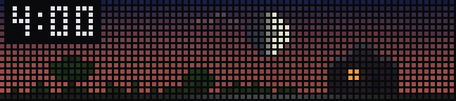
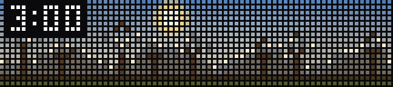
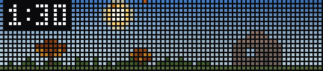
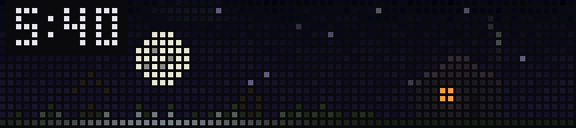

# skystrip — an ambient sky outside, on the bar

Skystrip renders an ambient scene using calculated daylight and weather data
for the configured location. Decorative and seasonal elements are identified
below. Routine values are available through the spoken report; active alert
cards include local expiry time.

**Firmware 1.2.3 brightness:** Auto can wash out dark scenes. Startup now
switches Auto to fixed 35% on that firmware, preserving existing manual levels.
See [known issues](../docs/known-issues.md) for the evidence, configuration,
ambient-adjustment tradeoff and opt-out.

> **Not a life-safety warning system.** Skystrip is a secondary ambient notice.
> NWS alert support exists only where its point API covers the configured
> location, and network, feed, host, device ownership, polling, or audio
> failures can delay or suppress an alert. Keep Wireless Emergency Alerts,
> NOAA Weather Radio, or the official local equivalent enabled.

## Geographic support

Skystrip is assembled from independent layers, so “supported here” is not one
yes/no map. The coordinate-based sky and the official-alert layer have
different footprints:

| Location / capability | What works | What does not carry the same claim |
|---|---|---|
| **Ordinary land locations worldwide** | Astral computes daylight from the configured coordinates. Open-Meteo supplies modeled current weather and the recent-past/future Time Machine; model choice and resolution vary by region. | This is model output, not a local station observation. `SKYSTRIP_TZ` must match the location for accurate local time; blank or unset uses UTC. Coordinates do not infer it. |
| **Inside `api.weather.gov` point coverage** | Everything above, plus the nearest NWS station observation, NWS period forecast, observed precipitation for past Time Machine slots, and point-filtered NWS CAP alerts. | Coverage is determined by whether NWS `/points` resolves the coordinate, not by a hand-maintained country list. It principally covers the United States and its territories; coastal/marine products vary by point and endpoint. |
| **Outside NWS point coverage** | The live scene, current report, and future outlook continue from Open-Meteo. RainViewer remains optional where its network covers the point; an operator-authorized lightning source can be configured separately. | There is no NWS period forecast, station observation, CAP alert card, or Extreme-alert siren. Past Time Machine precipitation is omitted rather than labeled as an observation. Obscurations (haze, smoke, dust, sand, ash) are unavailable because they are rendered only from supported NWS observation terms. |
| **Southern Hemisphere or tropical land** | Solar elevation, local clock (with the correct timezone), and weather remain coordinate-based. | Foliage, bare branches, autumn leaves, and summer fireflies currently follow a northern-temperate month calendar. Those scene details are decorative and are not locality-correct yet. |
| **Open ocean, polar edges, and tiny/offshore islands** | Astronomical calculations may still work, and Open-Meteo may return a nearby model grid cell. | This is not a supported primary target today. Open-Meteo defaults to a land-selected grid cell, civil timezone choice can be ambiguous, Web-Mercator radar ends at about 85.05 degrees latitude, and radar/lightning coverage may be absent. |

Radar and lightning are best-effort enrichments. A static RainViewer coverage
mask plus fresh composite metadata may report a dry point, but cannot establish
that every contributing radar is itself current. An uncovered, stale, or
unavailable composite is never treated as proof of clear weather. Live strike
effects are off by default and have no repo-defined geographic footprint:
their coverage is whatever the operator's configured, authorized source
provides.

RainViewer currently reports more than 1,200 radars across more than 150
countries, but its coverage is not continuous and has no availability
guarantee. Skystrip checks RainViewer's separate coverage mask before allowing
a blank radar tile to overrule the global model. These provider figures and
boundaries were reviewed on 2026-08-10; use the linked provider coverage pages
below for their current footprint.

The primary validated target is a northern-temperate land location inside NWS
point coverage. Other ordinary land locations use the global model sources and
omit the capabilities listed above.

The six silhouettes are fixed artwork rather than generated local geography;
the skyline and lakefront contain Chicago-inspired landmarks. The `chicago`
report style is place-specific. The `genz` style changes wording while
preserving the facts and numeric values from `plain`. When a severe alert is
active, the `genz` style uses its non-slang severe-report wording throughout.
Full words are used because some initialisms are not pronounced correctly by
the neural voice.

All three styles announce a lunar eclipse and share one facts function, so
their numeric values remain identical. The
percentage spoken is the fraction of the Moon's **face** covered, not the
umbral magnitude the catalogues quote: magnitude is a fraction of the
diameter. For example, a magnitude of 0.93 covers about 96% of the visible
disc. During
an eclipse the phase line is replaced rather than joined because the Moon is
always full during a lunar eclipse, making the ordinary phase clause redundant.
The `genz` severe-report branch also omits the eclipse and sky commentary.

Phrase selection is deterministic and seeded by local date and hour. The
report's text is hashed into the asset filename and the firmware
caches assets by path forever, so wording that rerolled per render would
bake and upload a fresh `.snd` every minute. Display labels
and narration are English-only, the clock is 12-hour, alert dates use
month/day, and the Moon's lit-side orientation is northern-hemisphere artwork.
Measurement output can be Fahrenheit/mph or Celsius/km/h.

The long-running watcher waits for a fresh observation/model snapshot before
its first scene. Live weather then has a two-hour lease: if both base-weather
sources stay missing or stale, Skystrip stops refreshing the old scene and
lets the BUSY Bar's native element timeout clear it instead of relabelling
expired data as current.

When both base feeds answer, Skystrip stages the station observation while it
fetches the model snapshot, then publishes one fused update. A stale,
incomplete, or schema-wrong response never becomes a visible half-update; if
the model call fails, a complete validated station observation can stand on
its own.

## What you're looking at



*Solstice dawn to dawn, half an hour per frame.*


- **The gradient** follows calculated solar elevation from your coordinates
  and clock (astral math — no API call, so it never goes stale). Dawn, midday,
  dusk and night follow the sun; the small sun icon's horizontal placement is
  an artistic composition, not an azimuth reading.
- **Cloud cover mutes it**, using the latest complete NWS station observation
  inside NWS point coverage and Open-Meteo elsewhere. Missing or stale fields
  are not proof of clear weather.
- **Thunderstorms** shift the whole sky storm green-grey.
- **Lightning flashes** represent nearby strikes from the optional secure
  WebSocket configured in `SKYSTRIP_LIGHTNING_WS`. Blank means off. The
  operator is responsible for using a relay or data source they are authorized
  to access; Skystrip contains no public/raw Blitzortung endpoint.
  A short native animation brightens the rendered sky behind the selected
  scene while the top status LEDs pulse; buildings, trees, water and status
  ink stay in place instead of the whole panel becoming a white strobe. Strike
  bursts collapse to the nearest report, and no full-scene effect runs without
  a fresh live sky underneath it. This feed drives ambient pixels only; it
  never selects an alert card or siren, which remain exclusively NWS CAP
  decisions.
- **The moon** is a locally calculated phase cue. Its on-strip position is
  artistic and does not assert that the Moon is above the horizon.
- **Earth's shadow crosses it during a lunar eclipse.** Eclipse geometry is
  computed locally from Meeus. The umbra is about 2.7 Moon-radii across and is
  offset according to the calculated geometry. The disc becomes copper inside
  the umbra, representing sunlight refracted through Earth's atmosphere.
  Moonlight on the scene scales with the fraction of the disc still in direct
  sunlight.

  **Penumbral eclipses are not drawn** because their small brightness change is
  below the intended panel representation. The layer is shown only while the
  Moon is above the configured location's horizon. Solar eclipses are outside
  this lunar layer.
- **Stars** are decorative points that appear as the calculated sky darkens
  and are muted by cloud.
- **Falling precipitation** is source-driven. Rain resolves from fresh,
  covered RainViewer radar, then an Open-Meteo nowcast, then fresh NWS station
  phenomena or a bounded last-good value. Snow uses NWS phenomena when that
  field is present and fresh, otherwise the Open-Meteo weather code. Missing
  feeds do not manufacture a clear observation.
- **Fog** is source-driven, not just inferred. A station or model that
  reports fog outright (NWS `fog`, `fog_mist`, `freezing_fog`, `ice_fog`, or
  WMO code 45/48) puts fog on the ground even when the official visibility
  reading stays healthy, which is what patchy fog looks like from a runway
  sensor. Low visibility still deepens it beyond that floor, and humid
  mornings still raise it on their own. Haze, smoke, dust, sand, and volcanic
  ash are rendered only when supported NWS observation terms report them; they
  are not inferred from visibility or model fields.
- **Haze, smoke, dust, sand and volcanic ash affect the full air column**
  instead of pooling near the ground. Each has a separate airlight tint and
  density. Dust and sand share one tan because their source colors differ by
  about 12% in red, below the panel's measured ~30% contrast threshold.

  The rendering uses the atmospheric model
  `observed = object × transmission + airlight × (1 − transmission)`.
  Airlight scales with daylight, preventing artificial nighttime brightening.
  The transform applies uniformly; dimmer pre-rendered elements converge on
  the airlight colour while brighter emissive marks remain more distinct.

  At night the four obscuration types become visually similar as airlight
  approaches zero. This layer is **NWS-only**:
  Open-Meteo's `weather_code` is the WMO subset that omits 04–09, so
  outside NWS point coverage an obscuration is never shown rather than
  being guessed at from a visibility number that fog would equally explain.
- **Snow that has already fallen lies on the ground**, using Open-Meteo's
  modeled `snow_depth` rather than the month. Three depths read differently: a
  dusting the grass still shows through, properly covered, and deep enough to
  bury the tufts entirely.
  Where it lands is per scene — grass in the yard, rooftops in the skyline,
  the banks but never the open water at the lakefront, the shoulders but never
  the road on the backroads.
- **Christmas decorations appear for a window around the holiday**, keyed to
  the calendar rather than any feed — `SKYSTRIP_CHRISTMAS` sets how wide that
  window is, `dec24-26` by default. How a decoration earns its pixels depends
  on what it's decorating: the house's roofline and the skyline's tower
  windows recolour something already lit — for the skyline specifically,
  lighting *extra* windows would change the tower's apparent occupancy, so
  existing warm/cool windows turn red or green instead of gaining neighbours.
  The lakefront and backroads conifers are the opposite case — a tree
  standing on bare bank or shoulder has nothing to recolour onto, so those
  ~8 pixels are new by necessity, not by exception. Where it lands is per
  scene — a string of red, green and warm bulbs along the house's roofline,
  a minority of the skyline's already-lit tower windows turned red or green,
  and a small lit conifer at the lakefront and on the backroads shoulder.
  Forest and grove keep their plain silhouette.
- **A small clock** sits in the corner.
- **The scene** — the silhouette along the bottom — is yours to pick.
- **Birds, windows, traffic, wildlife, smoke, fireflies, leaves and meteors**
  are ambience. They are not live detections.

## Controls

| Control | What it does |
|---|---|
| **Wheel turn** | Scrub the forecast. The time appears immediately; the sky follows once the wheel rests. |
| **Wheel click** | Back to now. |
| **START** (single press) | Next scene. |
| **START** (double press) | Speak the weather report aloud. |
| **Any available button or wheel action while an alert card is active** | Acknowledge it, silence it, and return to the selected live or Time Machine view. |

START belongs to Skystrip when the physical selector reports **OFF**. The
status stream sends changes rather than an initial selector snapshot, so after
a reconnect with the selector still OFF, Skystrip accepts START only after its
own view has landed and the device confirms that no BUSY timer is active. A
BUSY/CUSTOM selector or button status is never treated as a Skystrip press and
cannot acknowledge an alert or touch shared audio; wheel gestures remain the
app controls described above.

Scrubbing is *reveal-on-stop*: the readout updates on every wheel detent, while
the full scene is rendered after the input settles.

A report that is already cached starts immediately on a double START. On a
cache miss, the bar first shows the complete `PREPARING...` acknowledgement
for three seconds and the button handler returns; only then does one managed
background job generate and upload the voice asset. It never auto-plays when
that job finishes. If the same forecast, view, and alert state are still
current, the bar briefly says `START TWICE`; double START again to listen.
Changing views or receiving an unacknowledged alert suppresses that completion
notice but does not throw away useful cache work. A BUSY/CUSTOM refusal starts
no hidden job. Report files use a deterministic hash of their exact text and
voice, so an unchanged take is adopted after restart without being generated
again; an unplayable take advances to a new immutable repair path.

Most past Time Machine fields are recent-past model rows returned by
Open-Meteo's forecast endpoint, not archive reanalysis. Precipitation is the
deliberate exception: inside NWS point coverage it comes from nearby station
observation history, and outside that coverage it is omitted rather than
invented from model history. Future rows are model forecasts. Past model fields
are useful reconstructions, not a claim that a sensor observed every displayed
condition at the selected time.

## The seasons



*Twelve months at the same hour, in the same weather — every difference is the
calendar. The broadleaf crowns go to autumn quilt, bare winter lattice, then
fresh spring green. Summer nights get fireflies over the grass, and autumn
wind takes leaves off the trees.*

## Weather



*One midday under clear, overcast, drizzle, downpour, thunderstorm, a severe
warning, and snow. Rain uses three intensity tiers derived from radar dBZ.*

## Extreme-weather alerts

An active Actual NWS Warning or Emergency whose CAP severity is `Severe` or
`Extreme` gets an alert card and red status-light pulse. Watches and
advisories do not. The siren is narrower: CAP severity must be exactly
`Extreme`. Ordinary thunder, a Severe Thunderstorm Watch, and a Warning whose
CAP severity is `Severe` therefore do not sound the siren. Acknowledgement
belongs to that specific alert episode, so a later Extreme alert can arm again.

The alert name is bounded and presented without silently clipping arbitrary
text. Acknowledging it retires the alert card, stops its audio, and restores
the selected live or Time Machine view. If the live-weather lease expired
while the card was up, it stays clear rather than resurrecting stale weather;
a selected Time Machine frame can still return. The red status-light pulse
continues until a successful all-clear or the CAP product's own expiry ends
the episode.

The Extreme-alert tone is generated locally as deterministic 44.1 kHz PCM,
uploaded under a content-addressed filename, and reused from device storage;
there is no untracked siren recording to provision. If generation, upload, or
playback fails, the visual alert remains and audio success is not reported. A
partial or unplayable resident file moves to a new immutable
repair path, and obsolete generations are retained through a full-tone grace
period before removal so a prior process cannot lose audio mid-playback.

## Christmas



*The house roofline and the skyline windows, each with the treatment off then
on. Weather, clock and seed all stay fixed, so the decoration is the only
thing that changes.*

Two more scenes get one, off-camera here: a small lit conifer at the lakefront
and on the backroads shoulder. Forest and grove keep their plain silhouette.

## Scenes

Six silhouettes: `house`, `skyline`, `lakefront`, `forest`, `grove`,
`backroads`. START cycles through them, and the choice persists across
restarts.

You don't have to keep all six — `SKYSTRIP_SCENES` selects which ones are in
the rotation, so you can cycle between two you like instead of six you don't.

## Configuration

| Key | Default | What it does |
|---|---|---|
| `SKYSTRIP_LAT` | **required** | Latitude, decimal degrees; set with longitude |
| `SKYSTRIP_LON` | **required** | Longitude, decimal degrees; set with latitude |
| `SKYSTRIP_TZ` | `UTC` | IANA timezone matching the coordinates; currently explicit, not inferred |
| `SKYSTRIP_LIGHTNING_WS` | *(off)* | `.env`-only authorized secure lightning WebSocket using the Blitz-compatible strike schema; blank disables live strike effects |
| `SKYSTRIP_UNITS` | `f` | `f` = Fahrenheit/mph, `c` = Celsius/km/h |
| `SKYSTRIP_CLOCK_INK` | `orange` | Clock/temp colour: `orange`, `pink`, or `red`; each option passes the configured contrast checks. Red is also used for severe alerts. |
| `SKYSTRIP_STATION` | *(auto)* | Pin a four-character NWS station; blank discovers the nearest |
| `SKYSTRIP_CONTACT` | *(blank)* | Email or URL for the NWS User-Agent. Blank stays anonymous. |
| `SKYSTRIP_SCENES` | all six | Which scenes START cycles through |
| `SKYSTRIP_CHRISTMAS` | `dec24-26` | Christmas decorations window: `off`, `dec25`, `dec24-26`, `dec20-jan1`, `dec1-26` |
| `SKYSTRIP_VOICE` | `am_michael` | Kokoro report voice on supported Linux (`af_*`, `am_*`, `bf_*`, or `bm_*`). Linux uses `espeak-ng` when Kokoro cannot be imported or its model bank is unavailable; direct macOS development may use a non-Kokoro `say` voice. |
| `SKYSTRIP_STYLE` | `plain` | Spoken report style: `plain`, `chicago`, or `genz` |

`SKYSTRIP_LAT` and `SKYSTRIP_LON` have no geographic default. When unset, the
app uses 0,0 and reports that configuration is required; it does not label that
output as a configured location.

The timezone is a separate setting. It defaults to UTC and controls the local
clock and date, seasonal/holiday boundaries, Time Machine row timestamps,
alert expiry labels, and spoken-report timing. Set it to the IANA timezone that
matches the depicted location. Coordinates drive solar geometry; a fixed UTC
offset is not an adequate substitute because it loses daylight-saving and rule
changes. If the host and the depicted location differ, do not accept the
installer's host-timezone suggestion.

Automatic IANA timezone inference requires polygon-boundary data that is not
included in this repository. `SKYSTRIP_TZ` remains the authoritative override.

When `SKYSTRIP_LIGHTNING_WS` is configured, its relay contract is exact:

- Skystrip opens the configured `wss://` URL and sends `{"a": 111}` once.
- The client caps each reassembled, WebSocket-decompressed message at 256 KiB;
  its text guard also rejects more than 256K Python characters. Text messages
  may be plain JSON or legacy Blitz-compatible LZW text (decoded output is
  capped at 512K characters and 65,536 dictionary entries); binary messages
  must be UTF-8 JSON.
- Each message must be one JSON object. `lat` and `lon` must be finite JSON
  numbers in `[-90, 90]` and `[-180, 180]`; booleans and numeric strings are
  rejected. `time` must be a JSON integer containing Unix epoch nanoseconds,
  not seconds, milliseconds, a decimal, or a quoted number. Other fields are
  ignored.
- A strike more than 10 seconds old or more than 5 seconds in the future is
  dropped. Its real source age is retained on the monotonic effect clock, so a
  relay/reconnect backlog cannot look current after receipt.

Malformed messages are ignored without logging their payload. Skystrip logs a
value-free warning for the first invalid frame and periodic milestones, which
lets an operator spot a schema mismatch without putting source data or URL
secrets in the log.

Set ordinary values in `.env`, through barkeep's config editor, or by running
`deploy/install.sh`, which asks and won't take no for an answer.
`SKYSTRIP_LIGHTNING_WS` is the intentional exception: configure it only in the
gitignored, owner-only `.env`, because a relay URL may contain credentials and
Barkeep's LAN config API does not redact declared app values. Nothing personal
is ever committed to the repo. Barkeep snapshots shared `.env` when the daemon
starts, so changing this hidden key requires a Barkeep service/process restart;
the app-only restart button cannot reload it. With the installed service, run
`sudo systemctl stop "barkeep@$USER"`, then
`sudo systemctl start "barkeep@$USER"`.

## Running it

The watcher uses Open-Meteo's non-commercial free API under CC BY 4.0 and
RainViewer's public API for personal, educational, and small-scale community
use. The one-shot report uses Open-Meteo but not RainViewer. Read
[Provider terms and commercial use](#provider-terms-and-commercial-use) before
either live mode. The standalone guard flag enables the requests; it does not
grant data rights or assert that a deployment complies with either provider's
terms.

```bash
uv run apps/skystrip.py --enable-network-providers  # watcher; Ctrl+C clears
uv run apps/skystrip.py --once          # push one frame and exit
uv run apps/skystrip.py --report --enable-network-providers  # live report
uv run apps/skystrip.py --preview out.png   # render to a PNG, no device
```

`--preview` performs no device or provider I/O. `--once` talks to the bar but
renders a local snapshot and starts no Open-Meteo or RainViewer poller. A
Barkeep-managed Skystrip does not need the CLI flag: a fresh Barkeep starts in
**STANDBY**, displays the same provider limits and linked credits above the app
selector, and begins provider polling only after the operator selects
**skystrip**. Existing saved foreground choices continue to restore on restart.

`--preview` accepts overrides for testing specific weather, time, and seasonal
conditions: `--at 03:30`, `--cloud 0.5`, `--storm`, `--rain`, `--snow`,
`--snowdepth 0.30`, `--temp`, `--wind`, `--winddir`, `--humidity`, `--vis`,
`--fog`, `--obscuration haze|smoke|dust|ash`, `--month`, `--moonday`,
`--scene`, `--christmas`/`--no-christmas`.

`--christmas` / `--no-christmas` force the holiday treatment on or off
regardless of the calendar — useful for checking the roofline lights in July.
There's no way to set this outside `--preview`: on real hardware the
decorations always follow the date.

`--snow` is snow *falling*; `--snowdepth` is snow already *lying*, in metres.
They are independent — a clear day after a storm is `--snowdepth 0.2` with no
`--snow` at all. The three looks start at 0.01, 0.08 and 0.25 m:

```bash
uv run apps/skystrip.py --preview a.png --scene house --month 1 --snowdepth 0.03
uv run apps/skystrip.py --preview b.png --scene house --month 1 --snowdepth 0.12
uv run apps/skystrip.py --preview c.png --scene house --month 1 --snowdepth 0.40
```

Both flags are preview-only. On the device, snow depth comes from model data;
it is not a direct yard observation.

## Where the data comes from

- **[NWS / api.weather.gov](https://www.weather.gov/documentation/services-web-api)**
  — US station observations, forecasts, and CAP alerts. US public domain, no
  key. Wants a User-Agent with a contact; `SKYSTRIP_CONTACT` fills that in,
  blank stays anonymous.
- **[Open-Meteo](https://open-meteo.com/)** — global weather-model current,
  recent-past and forecast rows, and snow-depth values. Skystrip calls the
  forecast endpoint for all three; it does not claim archive reanalysis. The
  free API is non-commercial, best-effort, and its data requires CC BY 4.0
  attribution.
- **[RainViewer](https://www.rainviewer.com/api.html)** — composite radar
  tiles used to estimate precipitation intensity. Its public API is intended
  for personal, educational, and small-scale community use, requires
  attribution, and has no availability guarantee. Its separate
  [coverage map](https://www.rainviewer.com/coverage.html) currently lists
  1,200+ radars in 150+ countries, with known gaps in remote, mountainous,
  oceanic, and polar areas. Composite timestamps describe mosaic generation,
  not the observation time of every contributing radar, and the separate
  coverage mask changes less often than the weather frames.
- **Optional operator-supplied lightning WebSocket** — disabled by default.
  The endpoint must use `wss://`, accept the Blitz-compatible subscription,
  and stream bounded JSON strikes using the
  [documented schema](https://www.limaps.org/json-data-archive.html): `time`
  (Unix epoch nanoseconds), `lat`, and `lon`. It must not put credentials in
  tracked files; userinfo, a capability path, or a query token may be kept in
  the gitignored `.env`, which the installer sets to mode `0600`. Skystrip
  disables the WebSocket library's transport logger and never logs the URL or
  exception text. An invalid or insecure endpoint is ignored, leaving
  lightning off without crash-looping the rest of Skystrip.
  “Blitz-compatible” describes only that wire schema; it grants no data rights
  and makes no global-coverage claim. Operators must use a relay or source they
  are authorized to access. Blitzortung's
  [official terms](https://www.blitzortung.org/en/contact.php) say raw data is
  limited to participants or explicitly approved users and that external apps
  must retrieve it from a separate server, not Blitzortung's servers. Those
  terms also prohibit using Blitzortung data for storm-warning systems.
  Skystrip uses this optional feed only for ambient strike flashes; NWS CAP,
  not lightning input, controls its separate alert and siren paths.
- **Astral** computes solar elevation and the lunar phase input locally, and
  the Moon's altitude for the eclipse visibility gate. Icon positions remain
  part of the pixel composition rather than a sky map.
- **No feed publishes eclipses.** `api.weather.gov/alerts/types` lists 111
  event types and none of them are astronomical; Open-Meteo is a weather
  model with no eclipse field. Eclipse circumstances therefore come from
  Meeus, *Astronomical Algorithms* 2nd ed. ch. 54, evaluated in
  `apps/skystrip_app/eclipse.py` with no ephemeris file and no network call.
  `tests/test_skystrip_eclipse.py` pins the result against NASA's
  five-millennium catalogue — times, magnitudes, and the *sign* of gamma,
  which is the term that decides which limb goes dark first.

### Provider terms and commercial use

Selecting Skystrip in Barkeep or starting its standalone watcher enables its
built-in Open-Meteo and RainViewer clients; the standalone report enables only
Open-Meteo. There are no per-provider switches or paid-service credential
fields. If your deployment is not covered by the providers used by that mode,
leave Skystrip stopped (choose **dsn** or **STANDBY** in Barkeep) until you
have implemented and reviewed an appropriately licensed data path. Do not put
a commercial API key or credential-bearing endpoint in `apps.toml`: declared
values are readable through Barkeep's config API.

Open-Meteo's [terms](https://open-meteo.com/en/terms) direct commercial users
to a [paid API plan](https://open-meteo.com/en/pricing). That service uses a
different customer contract and may require an authenticated endpoint; this
repository does not claim that changing the hostname alone is sufficient.
RainViewer asks commercial or high-volume integrators to arrange terms with
them directly and currently documents no general-purpose paid tier. In either
case, obtain the provider's terms first, then add a secret-safe client contract
and tests before enabling the provider. The linked credits remain required for
the public services and are shown beside Barkeep's live display preview.

## Implementation notes

- **Generated assets are versioned and swept.** The firmware caches files by
  path forever and may hold one open while playing it, so nothing is ever
  overwritten — new generations get new names, and startup reaps whatever a
  previous process abandoned. Skipping that sweep once left 213 orphaned files
  and 40 MB stranded on device flash.
- **Draws yield on HTTP 409** while a BUSY/CUSTOM focus session owns the
  display. That's normal, not an error.
- **Elements carry a timeout**, so if the watcher dies the bar clears itself
  rather than freezing on a stale sky.
- **This is the app most likely to be copied from**, so a stale pattern here
  propagates into every new app. Check `git log -S` before lifting an approach
  out of it.
- **Phenomenon vocabularies are pinned to the feed, not to expectations.**
  `tests/test_skystrip_obs_vocabulary.py` holds api.weather.gov's published
  36-value `presentWeather` enum and fails when a value is neither
  classified nor listed as a deliberate omission. That test exists because
  substring-matching a JSON dump silently shipped four defects at once:
  fog matched nothing, `ice_pellets` was searched for as "ice pellets" with
  a space, `snow_showers` set rain because it contains "shower", and `hail`
  counted as precipitation in the Time Machine while the live scene drew a
  clear sky. Add a phenomenon by extending the vocabulary sets, never by
  adding another substring.
- **Renderer tests must pin the observer.** The module defaults are the
  deliberate 0,0/UTC fallback for an unconfigured install, so a test that
  renders "midday" against them puts the sun on the Gulf of Guinea's
  horizon and compares a sunset to a smoke day. Measure change against a
  baseline render rather than absolute brightness, too: fog and haze are
  bright at noon and dark at dawn, so a brightness metric silently
  measures the hour instead of the weather.

## Portability and licensing

Keep Skystrip portable: personal values belong in `.env` (documented in
`.env.example`), never in code. `deploy/install.sh` is the supported setup path.
Note that `busybar_dev/anim.py` is ported from GPL-2.0-or-later firmware
tooling, so the released project uses the same licence and its attribution
header stays intact.
