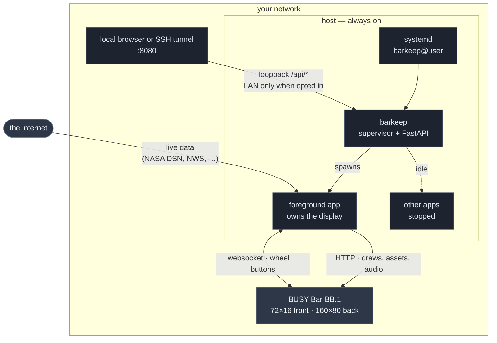
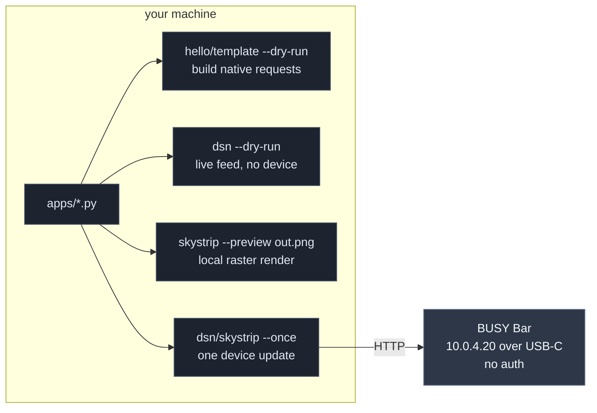

# Architecture

Apps run either on an always-on host or from a development computer over USB.
Both paths use the same app code. Device addresses are supplied through
configuration and are not hardcoded in `apps/`.

## What you need

| | |
|---|---|
| **A host** | For the supported service path, 64-bit glibc 2.28+ Linux on `x86_64` or `aarch64`, CPython 3.11–3.13, and an always-on network path. A Pi 4/5 with 64-bit Raspberry Pi OS and at least 2 GiB RAM, NUC, 64-bit laptop, or VM can fit; see the [support and resource matrix](dependencies.md) |
| **A path to the bar** | The bar plugged into the host over USB (it answers at `10.0.4.20`, no auth), *or* the bar on your network with HTTP API access enabled and its PIN in `BUSYBAR_TOKEN` |
| **Outbound internet** | During setup/updates for Git, packages, and Kokoro models; also while running live-data apps |

The host does **not** need to be reachable from the internet. Everything the
apps do is outbound.

## Production



Over USB, the bar answers at `10.0.4.20` without authentication. Over the LAN,
enable HTTP API access in the bar's local web UI and put its PIN in
`BUSYBAR_TOKEN`. Both modes use `connect()`; their authentication requirements
differ.

barkeep is the only thing systemd knows about. It parents every app process, so
restarting the unit restarts the apps. One foreground app owns the display at a
time, because [apps cannot overlay](../apps/README.md#why-apps-dont-overlay).

## Development



Over USB the bar answers at `10.0.4.20` with **no token**. Prefer that address
over `busybar.local`: when the bar is also on Wi-Fi, the hostname resolves to
*both* addresses and requests hang at random. `connect()` already tries USB
first.

Do not run an app manually while Barkeep is running the same app. The two
processes produce competing display writes until one stops.

You do not need a bar for offline development. Hello and the template build
native request data, DSN exercises
its live NASA feed without device I/O, and Skystrip renders its app-owned raster
scene to PNG. The test suite uses neither a bar nor external services. There is
no generic firmware-text PNG renderer, so not every app exposes `--preview`.

## Shipping a change

The host deploys revisions from the configured Git remote. A clean clone can
reproduce any deployed revision without files from the development machine.

```mermaid
sequenceDiagram
    autonumber
    participant D as your machine
    participant G as origin<br/>(GitHub)
    participant P as host
    participant B as bar

    D->>D: uv run pytest
    D->>D: git commit
    D->>G: git push origin main
    Note over D,P: ./deploy/ship.sh <host><br/>refuses if the commit is not on origin
    D->>P: ssh: go and fetch <sha>
    P->>G: git fetch origin
    P->>P: verify target unit; stop barkeep@user
    P->>P: git reset --hard <sha>
    P->>P: locked sync<br/>verify Kokoro synthesis; start barkeep@user
    P->>P: verify the unit came back
    P-->>D: "<sha> live on <host>"
    P->>B: apps redraw within seconds
```

`ship.sh` **refuses to deploy a commit that is not on `origin`**, because the
host would not be able to fetch it. Origin remains the complete, reproducible
source of every deployed revision.

Deployment resets the host checkout to the requested commit, discarding local
tracked-file edits and avoiding merge conflicts. Per-host `.env` and `config/`
files are gitignored and remain in place.

Full detail, including the read-only deploy key a private-repo host should use,
is in [`deploy/README.md`](../deploy/README.md).

## Where the pieces live

```
apps/            the apps, plus a per-app .md and _template.py
  README.md      every control binding in one table
barkeep/         supervisor (no HTTP), server (thin routes), static/ (talks only to /api/*)
busybar_dev/     connect(), anim.py (GPL-2.0-or-later), tts.py, screen.py
busybar_viz/     the offline visual debugger (`busybar-viz`) — renders, audits,
                 and pins app pixels; production apps never import it
apps.toml        the app registry — an app not listed here cannot be run
deploy/          ship.sh, install.sh, render_service.py, barkeep.service, README.md
docs/            index, first-party guides, media, retained busylib docs, design records
AGENTS.md        contributor and architecture guide
.claude/skills/busybar-app/SKILL.md
                 device drawing and interaction constraints
scripts/         new_app.py, refresh_docs.py, make_demo_gifs.py,
                 check_coverage.py, check_public_release.py
tests/           hardware-free behavior and contract tests
```

## Display ownership and priority

Priority is **not** z-order. A draw is accepted when its priority is `>=` the
running app's, so an equal-priority draw from a different `application_name`
replaces the current display. Two apps do not composite. Barkeep therefore has
a single foreground slot. An interrupting app must own the strip for a bounded
interval and then release it.

Additional device behavior and panel-specific failure modes are documented in
[`.claude/skills/busybar-app/SKILL.md`](../.claude/skills/busybar-app/SKILL.md).
